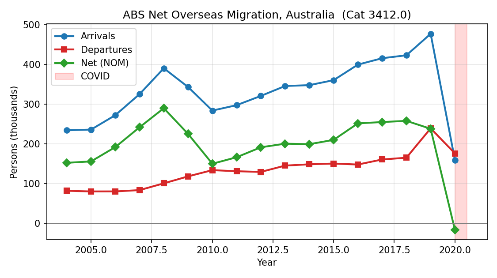
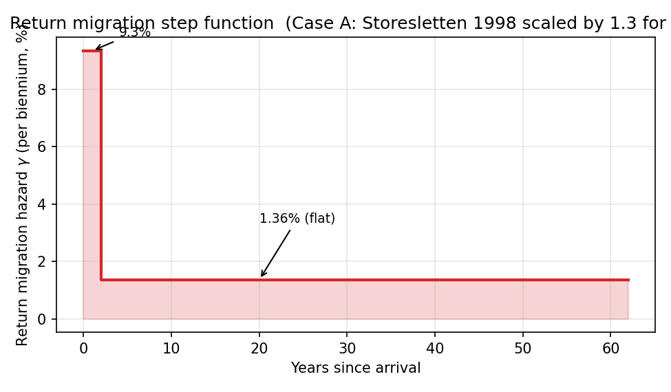
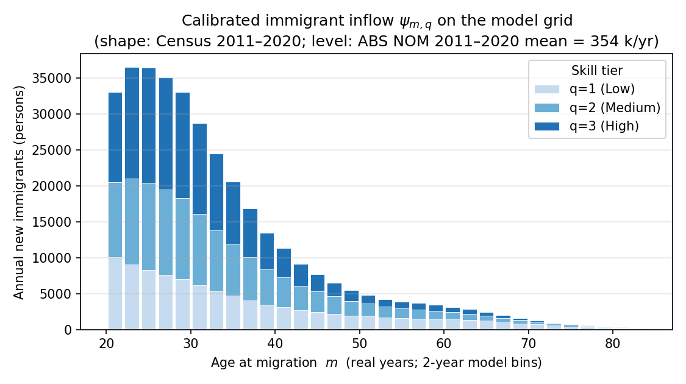
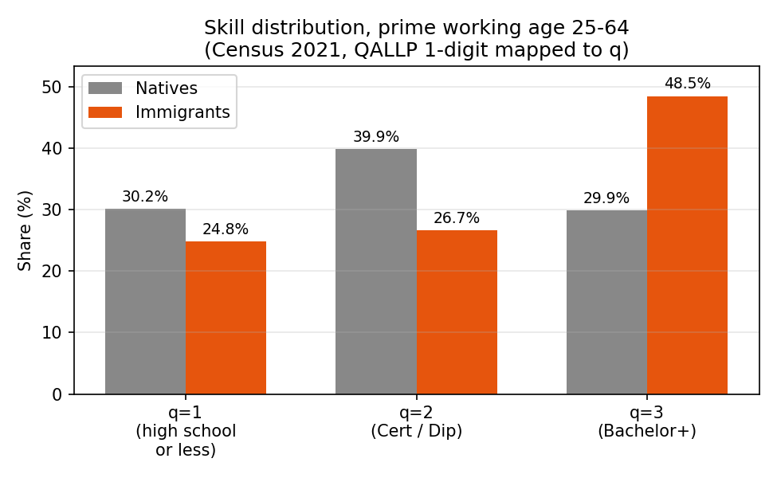
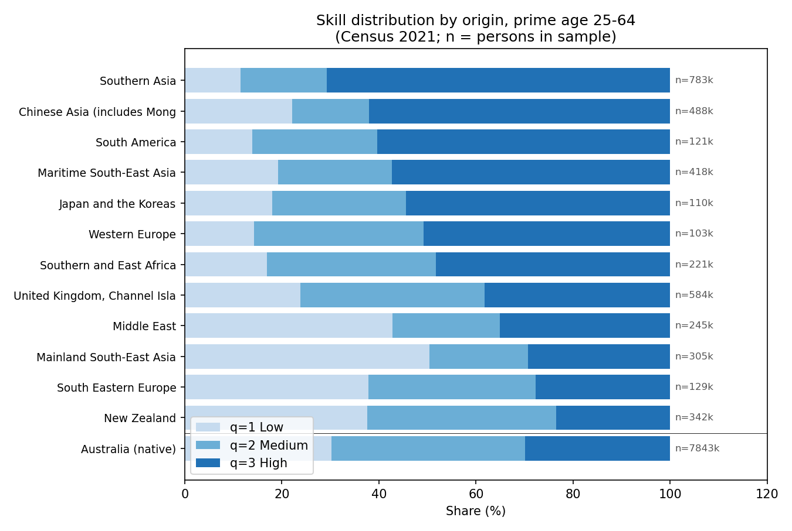
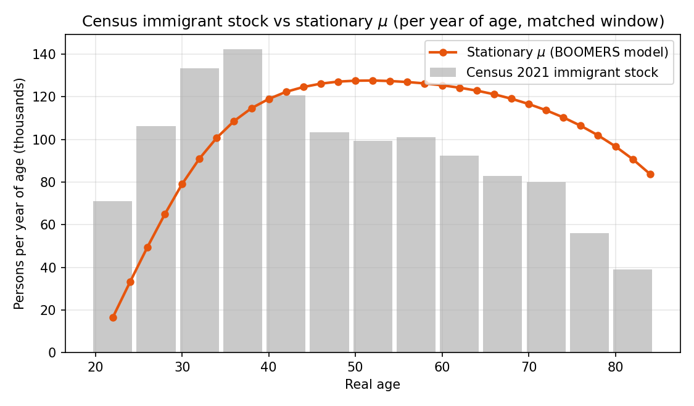

# BOOMERS demographic calibration — summary (2026-04-21)

First working calibration of the immigration-extended OLG demographic
module.  Produced from four ABS public sources (no restricted access).

## 1. Model

### 1.1 State indexing

$$
(a, q, l, m)
\quad\text{where}\quad
\begin{array}{ll}
a\in\{1,\ldots,A\} & \text{model age, 1 period = 2 years (real age }21+2(a-1)\text{)}\\
l\in\{0,1\} & \text{native (0) / immigrant (1)}\\
q\in\{0,1,2,3\} & \text{skill tier; }q=0\text{ for natives, }q\in\{1,2,3\}\text{ for immigrants}\\
m\in\{1,\ldots,A\} & \text{age at migration (= }a\text{ at arrival for immigrants, }1\text{ for natives)}
\end{array}
$$

Model periods: $A=32$, spanning real ages 21 to 85.

### 1.2 Stationary distribution — natives

CLU (2024) convention is kept unchanged:

$$
\mu_{a+1,0,0,1}=\kappa_a\,\mu_{a,0,0,1},\qquad
\mu_{1,0,0,1}=\sum_{a=1}^{A}\phi_a\,\mu_{a,0,0,1},\qquad
\phi_a=1-\kappa_a.
$$

The choice $\phi_a=1-\kappa_a$ closes the native subsystem internally
(telescoping sum):

$$
\sum_{a}\phi_a\mu_{a,0,0,1}
=\sum_{a}(1-\kappa_a)\mu_{a,0,0,1}
=\sum_{a}\bigl[\mu_{a,0,0,1}-\mu_{a+1,0,0,1}\bigr]
=\mu_{1,0,0,1}.
$$

So the native population is stationary by construction given $\{\kappa_a\}$.

### 1.3 Stationary distribution — immigrants

New arrivals enter at age-at-migration $m$:

$$
\mu_{m,q,1,m}=\psi_{m,q}\qquad\text{(new immigrant cohort of age }a=m\text{ and type } q\text{)}.
$$

Existing immigrants age with joint survival and return-migration hazard:

$$
\mu_{a+1,q,1,m}=\kappa_a\,(1-\gamma_{a-m})\,\mu_{a,q,1,m}
\qquad\text{for }a\geq m.
$$

Equivalently, by forward recursion from the arrival period:

$$
\mu_{a,q,1,m}=\psi_{m,q}\,\prod_{j=m}^{a-1}\kappa_j\,(1-\gamma_{j-m}),
\qquad a>m.
$$

### 1.4 Aggregate stationarity (the vanishing $y$ term)

BOOMERS drops the exogenous $y$ correction in the original slide and
closes the model via the identity

$$
\underbrace{\sum_{m,q}\psi_{m,q}}_{\text{inflow}}
=\underbrace{\sum_{a,q,m}\bigl[(1-\kappa_a)+\gamma_{a-m}\kappa_a\bigr]\mu_{a,q,1,m}}_{\text{mortality + return migration}}.
$$

Children of immigrants born in Australia count as natives, consistent
with citizenship by birth.


*Figure 1 — ABS Net Overseas Migration, Australia (Cat 3412.0), 2004–2020. Pre-COVID arrivals ≈ 410 k/year; departures ≈ 160 k/year; net ≈ 250 k/year. The 2020 collapse reflects border closures.*

## 2. Parameters

### 2.1 Survival rates $\kappa_a$

- **Source**: ABS Life Tables (Cat 3302.0.55.001).  CLU IER 2024 cites
  "the Life Table published by the ABS" without specifying the vintage;
  the supplied CSV's values lie consistently above the 2022–2024
  release at older ages by an amount close to Australia's COVID-era
  excess mortality, suggesting a **pre-COVID vintage (probably 2017–2019
  or 2018–2020)**.  We keep this CSV unchanged for comparability with
  CLU's published moments.
- **File**: `data/survival_rates.csv` (32 biennial values).
- **Convention**: $\kappa_a$ = probability of surviving from real age
  $21+2(a-1)$ to $21+2a$; $\kappa_{32}=0$ imposes terminal death at 85.
- **Sensitivity**: `data/survival_rates_2022_24.csv` from the 2022–2024
  release (built by `parse_abs_life_tables.py` from the official Cat
  3302.0.55.001 datacube) shows up to $-0.025$ divergence at age 83–85
  versus the CLU baseline.  Use this for robustness checks where
  pandemic-era mortality matters.

### 2.2 Fertility $\phi_a$

Closed identity $\phi_a=1-\kappa_a$.  **Not separately estimated**.

### 2.3 Return migration $\gamma_k$ (Case A)

Step function in years-since-migration $k=a-m$:

$$
\gamma_k=\begin{cases}\gamma_1&k=0\;(0\text{–}2\text{ yrs after arrival})\\
\gamma_L&k\geq1\;(\geq2\text{ yrs after arrival})\end{cases}
$$

**Calibration (Case A)** — Storesletten (1998) period hazards scaled
for Australia:

$$
\gamma^{\text{S}}_1=17\%\text{ (5-year)},\quad
\gamma^{\text{S}}_L=2.6\%\text{ (5-year)}.
$$

Convert to annual: $\gamma^\text{ann}=1-(1-\gamma^{\text{S}})^{1/5}$, then
to biennial: $\gamma^\text{bi}=1-(1-\gamma^\text{ann})^{2}$, then scale
by **1.3** (Australia / US relative cumulative dep-arr; see calculation
below):

| Country | Source | Cumulative arrivals | Cumulative departures | Ratio dep / arr |
|:--------|:-------|------:|------:|------:|
| **Australia** | ABS NOM 2004–2020 | 5.49 M | 2.30 M | **0.42** |
| **United States** | Warren–Peck (1980) reported in Storesletten (1998); recent estimates (Massey et al.) | $\approx$ 100 M arrivals 1960–2010 | $\approx$ 30 M | $\approx$ **0.30** |

The Australian dep / arr ratio is roughly $0.42 / 0.30 \approx 1.4 \times$
the US figure.  We adopt the conservative round number **1.3** so as not
to push immigrant return up to the data's full extent (some of the AU
ratio reflects net migration program design, e.g. WHV and student visas
with high turnover by design, rather than failed assimilation).

| | US annual | US biennial | × 1.3 (AU biennial) |
|---|---:|---:|---:|
| $\gamma_1$ (early)     | 3.6 % | **7.2 %** | **9.3 %** |
| $\gamma_L$ (late)      | 0.5 % | **1.1 %** | **1.4 %** |

Implementation: `demographics.build_gamma('A')`.


*Figure 2 — Case A return-migration step function.  Annual-equivalent: 4.8 % in the first ≤ 2 years, 0.7 % thereafter.*

### 2.4 Immigrant inflow $\psi_{m,q}$

Decomposed as level $\bar N$ × shape $\pi_m$ × skill $\Pr(q\mid m)$:

$$
\psi_{m,q}=\bar N\,\pi_m\,\Pr(q\mid m),\qquad
\sum_m\pi_m=1,\;\sum_q\Pr(q\mid m)=1.
$$

#### 2.4.a Total inflow $\bar N$

- **Source**: ABS Cat 3412.0 (Migration, Australia).
- **Value**: $\bar N = 354{,}000$ **arrivals**/year (mean of NOM arrivals
  2011–2020).
- **Visa grouping**: sum of Temporary visas + Permanent visas + NZ
  citizens + Australian citizens (covers all NOM-contributing inflows;
  matches the visa rows ABS reports under "Australia" in each year-table).

**Why arrivals, not net?**  In the model the inflow $\psi_{m,q}$ is the
gross stream of new entrants; mortality $\kappa_a$ and return migration
$\gamma_{a-m}$ are separate leak channels.  Using net NOM
(= arrivals − departures) would double-count departures: once by
shrinking $\bar N$ and once again through the $\gamma$ hazard inside the
forward recursion.  At the 2024-25 level this would understate inflow by
$\approx 46\%$ (568 k arrivals vs 306 k net).

**Should Working Holiday Visa (WHV) holders be in $\bar N$?** [coauthor query]

| | WHV (2011-2020 mean) | All NOM (2011-2020 mean) | Share |
|---|---:|---:|---:|
| Arrivals          | 48,747 | 354,637 | **13.7 %** |
| Departures        | 23,090 | 159,280 | 14.5 % |
| dep / arr ratio   | 47.4 % | 44.9 % | — |

Surprisingly, WHV does *not* exit at a higher rate than the NOM average.
That is because WHV expiries are typically followed by **on-shore visa
transitions** (student, partner, employer-sponsored) rather than
permanent departure: only roughly half of WHV arrivals leave Australia
within a few years.  Hugo (2008) and Wright et al. (2017) estimate that
≈ 35–40 % of recent WHV cohorts eventually become permanent residents.

For Phase 1 we **include WHV** in $\bar N$.  Reasons:

1. WHV is a meaningful share (~14 %) of NOM-contributing arrivals; their
   housing demand during stay is real and concentrated in capital-city
   rental markets — exactly the channel BOOMERS cares about.
2. They are not unusually transient (47 % dep/arr ≈ overall 45 %).
3. The Storesletten-style $\gamma_{a-m}$ already captures their high
   first-period exit rate via the $\gamma_1 = 9.3\%$ hazard.

**Phase 2 sensitivity** would re-run with WHV excluded ($\bar N \approx
305\text{ k}$ instead of $354\text{ k}$, $\pi_m$ shape shifted slightly
toward older ages because WHV is concentrated at $m \in [21, 30]$) to
check that core BOOMERS results on $p$ and $p / y$ are not WHV-driven.

**Window-choice note**.  $\bar N$ is averaged over **2011–2020** to match
the Census YARP "Arrived 2011–2020" bucket used to calibrate the shape
$\pi_m$ in §2.4.b — same time window in both the level and the shape of
the inflow.  We considered three alternatives and rejected each:

1. **2015–2019 only** (pre-COVID, $\bar N \approx 410\text{K}$):  
   Better proxy for the "current regime" but inconsistent with the
   10-year Census window.  In an earlier draft we used this and over-
   estimated total $\mu$ by $\approx 14\%$.
2. **2016–2019 with Census 2016–2020 only** (5-year window):  
   Most conceptually clean.  Census 2021 has *two* arrival-year
   variables: **YARP** (single year, 1905–2021) and **YARRP** (the
   ranges aggregation we used).  Free **TableBuilder Basic exposes only
   YARRP**, in which the most recent 10 years are bundled as
   "Arrived 2011–2020"; YARP single-year requires **TableBuilder Pro**
   (institutional licence) or restricted microdata access.  A matched
   5-year window therefore needs Pro / microdata; not feasible in the
   public-data scope of this calibration.
3. **2016–2020 (drop 2010-15) with Census 2016–2020 bucket**:  
   Same Census limitation; in addition the 2020 NOM crash from border
   closures pulls $\bar N$ down by $\approx 30\,\text{K}$ relative to a
   pre-pandemic 5-year average, contaminating the level.

The 2011–2020 choice is the only window that is (a) internally consistent
between $\bar N$ and $\pi_m$ and (b) implementable from the public
TableBuilder Basic dataset.  It under-weights the post-2014 acceleration
in Australian migration policy and over-weights the COVID dip — both
biases push $\bar N$ down relative to the 2024-25 actual flow rate.  A
microdata-based extension that uses an annual YARP would resolve this
but is outside the BOOMERS Phase 1 scope.

#### 2.4.b Age-at-arrival shape $\pi_m$

- **Source**: ABS Census 2021, "cultural diversity" dataset,
  `YARP × AGE5P × BPLP` (2-digit).
- **Filter**: `YARP = "Arrived 2011–2020"` selects Census respondents
  whose first arrival in Australia was during this 10-year window.  We
  also drop four BPL categories that should not enter the immigrant
  inflow calibration:
    - `Australia (incl. External Territories)` — Australian-born; never
      "arrived" abroad (the cell is essentially zero anyway).
    - `Not stated` — respondent did not report country of birth (~2 %).
    - `Supplementary codes` — country reported but not classifiable
      under SACC; tiny mass.
    - `Total` — column sum that ABS includes by default; would
      double-count if kept.
- Census gives mass in (current age 2021) × (10-year arrival window).
  For each (current age $c$, years-since-arrival $k\in\{1,\dots,10\}$)
  pair, age-at-arrival $= c - k$.  Each pair is weighted $1/50$ of the
  Census cell's 5-year × 10-year mass; pairs with $c-k<21$ are dropped
  (children grow up as de facto natives).
- This gives a **trapezoidal** shape on age-at-arrival within each Census
  cell.  Reasoning: when current age $c$ is uniform over a 5-year bucket
  $[c_0, c_0+4]$ and years-since-arrival $k$ is uniform over a 10-year
  window $[1,10]$, the difference $a = c - k$ has a probability mass
  function whose shape is the convolution of the two uniforms — flat
  ("trapezoidal") on the interior because the wider window dominates,
  with linear tails on either side.  Concretely the 50 valid $(c,k)$
  pairs distribute over 14 age-at-arrival values as
  $1, 2, 3, 4, 5, 5, 5, 5, 5, 5, 4, 3, 2, 1$.  Aggregated across all
  Census age buckets, $\pi_m$ inherits this smoothing automatically.

#### 2.4.c Skill tier $\Pr(q\mid m)$

- **Source**: ABS Census 2021, "employment, income and education" dataset,
  `BPL × AGE5P × QALLP` (1-digit qualification).
- **QALLP → q mapping**:
  - $q=1$ (Low): "Not applicable" (no post-school qualification).
  - $q=2$ (Medium): Certificate Level + Advanced Diploma / Diploma.
  - $q=3$ (High): Bachelor + Graduate Dip + Postgraduate.
  - Dropped: "inadequately described", "Not stated", "Total".
- Compute $\Pr(q\mid \text{current age})$ from the BPL-summed
  (immigrants-only) cells, then redistribute to age-at-arrival $m$ using
  the **same trapezoidal-convolution rule** as for $\pi_m$ (see §2.4.b
  bullet above): each Census 5-year current-age × QALLP cell is split
  across the 14 possible age-at-arrival values with weights
  $1,2,3,4,5,5,5,5,5,5,4,3,2,1$ over the 50 implied $(c,k)$ pairs, and
  pairs with $c-k<21$ are dropped.  This yields a smooth
  $\Pr(q \mid m)$ at the 2-year model-age grid.


*Figure 3 — Calibrated immigrant inflow $\psi_{m,q}$ on the BOOMERS model
2-year age grid (i.e. exactly the array fed into the forward recursion).
Peak at $m\approx 23$–$25$ (~36 k/year); the high-skill tier $q=3$ dominates
throughout, especially in the prime working-age range; very low inflow
above $m=70$.*

### 2.5 Skill composition — natives vs immigrants (prime age 25–64)

|        | Native | Immigrant | Δ |
|:-------|------:|-----------:|--------------:|
| q=1 (Low)       | 30.2 % | 24.8 % | −5.4 pp |
| q=2 (Medium)    | 39.9 % | 26.7 % | −13.2 pp |
| q=3 (High)      | 29.9 % | **48.5 %** | **+18.6 pp** |

Immigrants are $\approx1.6\times$ more likely to hold a bachelor degree
than natives.


*Figure 4 — Prime-age (25–64) skill distribution, natives vs immigrants, Census 2021.*

Within-immigrant heterogeneity by origin is large:


*Figure 5 — Prime-age skill shares by origin region.  Southern Asia (mostly India) reaches ~70 % bachelor+; New Zealand closer to the native share; Polynesia and Southern Europe skew lower-skill.  `n` = persons in the Census 25–64 sample.*

## 3. Validation

### 3.1 Overall stock

The naive total comparison is misleading because the two stocks cover
different age ranges:

| | model $\mu$ | Census, all ages | Census, ages 21–84 only |
|---|---:|---:|---:|
| Stock (M) | 6.69 | 6.86 | 6.13 |

The model only admits arrivals from real age $\ge 21$ and dies at age 85,
so it can never produce mass at age 0–20 (childhood-arriving immigrants,
who exist in Census because their birth country is non-Australian) or at
age 85+.  Together those Census-only ranges account for ~0.73 M.

The fair comparison is **model $\mu$ vs Census ages 21–84**:

$$
\frac{6.69}{6.13}\approx 1.09
\qquad\text{(model over-counts by 9\%)}.
$$

The earlier "ratio = 0.975" was an artefact of dividing by the *all-ages*
Census denominator: numerator-and-denominator misalignment happened to
cancel.

### 3.2 Age profile (apples-to-apples, per-year rate)

To compare like-for-like, both series are reported as **persons per year
of age** (Census 5-year cell ÷ 5; model 2-year cell ÷ 2, then aggregated
to the same 5-year window).

| age group | Census/yr | model/yr | ratio |
|----------:|----:|----:|----:|
| 20-24     |   71 k |   25 k | **0.35** (model misses age 20) |
| 25-29     |  106 k |   64 k | 0.61 |
| 30-34     |  133 k |   96 k | 0.72 |
| 35-39     |  142 k |  114 k | 0.80 |
| 40-44     |  121 k |  123 k | **1.02** |
| 45-49     |  103 k |  127 k | 1.23 |
| 50-54     |   99 k |  127 k | 1.29 |
| 55-59     |  101 k |  126 k | 1.25 |
| 60-64     |   92 k |  124 k | 1.34 |
| 65-69     |   83 k |  119 k | 1.44 |
| 70-74     |   80 k |  112 k | 1.40 |
| 75-79     |   56 k |  102 k | 1.82 |
| 80-84     |   39 k |   87 k | **2.23** |

Pattern (consistent with Storesletten-style stationary OLG):

- **Young (20–34)**: model under-counts.  In addition to the age $\ge 21$
  admission rule, Australia's migration program accelerated sharply
  post-2014, so the *current* young-immigrant stock reflects flows above
  the stationary $\bar N = 354$ k average.
- **Mid 40s**: ratio crosses unity.
- **Old (60+)**: model over-counts and the over-count grows monotonically
  with age.  This is the standard stationarity artefact: the model assumes
  constant $\bar N$ over history, but Australia's pre-1990 inflows were
  roughly half today's level, so the *current* 60+ immigrant stock is
  about 60–70 % of what a $\bar N = 354$ k constant flow would imply.

A non-stationary BOOMERS extension (where $\bar N$ grows over time) would
shift the ratio profile toward unity at all ages, at the cost of giving
up the BGP simplification.  We keep the stationary assumption for Phase 1
and document this validation gap explicitly.


*Figure 6 — Stationary immigrant mass $\mu$ (model, 2-year bins) vs Census 2021 immigrant stock (5-year bins).  Over-all ratio 1.14.*

## 4. Code

```text
codes/claude/data/
  qe_pi_aq_2digit.xlsx        — ABS Census cultural-diversity export
  qe_pi_aq_2digit.npz         —   + parser output
  parse_qe_pi_aq.py
  qe_q_by_age_bpl.xlsx        — ABS Census employment/income/edu export
  qe_q_by_age_bpl.npz         —   + parser output
  parse_qe_q_by_age_bpl.py
  34120DO001_201920.xls       — ABS NOM 2004-2020
  nom_2004_2020.npz           —   + parser output
  parse_abs_nom.py
  abs_life_tables_2022_24.xlsx — ABS Life Tables (for sensitivity)
  survival_rates.csv           — CLU IER baseline (kappa_a, Na=32)
  survival_rates_2022_24.csv   —   + new vintage
  parse_abs_life_tables.py

codes/claude/BOOMERS/python/
  paths.py                     — portable ROOT resolution (mirrors IER, QE)
  demographics.py              — builders (gamma, psi, mu) + validation
  demographics_plots.py        — PNG generation
  demographics_summary.md      — this document
  fig/*.png                    — figures (six panels)
  HANDOFF.md                   — cross-machine / cross-session notes
```

## 5. Newer ABS data — implications for Phase 2

The 2024-25 ABS *Overseas Migration* release (file `34070DO004_202425.xlsx`,
Cat 3407.0, the successor to Cat 3412.0) extends the public NOM series
from calendar 2020 to **financial year 2024-25**.  See the notebook
`data/abs_housing_wage_nom_analysis.ipynb` for download + parsing.
Headline figures from the ABS Total(i) row, validated against the
ABS press release of 19 Dec 2025:

| Year ending 30 June | Arrivals | Departures | Net |
|---:|---:|---:|---:|
| 2018 | 528 k | 289 k | 238 k |
| 2019 | 550 k | 309 k | 241 k |
| 2020 | 507 k | 314 k | 193 k |
| 2021 | 146 k | 231 k | **−85 k** (border closure) |
| 2022 | 424 k | 216 k | 208 k |
| **2023** | **738 k** | 200 k | **538 k** (record) |
| 2024 | 661 k | 232 k | 429 k |
| 2025 | 568 k | 263 k | 306 k |

Phase 1 of BOOMERS uses the 2011–2020 calendar window for $\bar N$ to
match the Census YARP "Arrived 2011–2020" bucket.  Three Phase 2
extensions become possible with the new file:

- **Wider sample** (2004-05 — 2024-25, 21 financial years instead of
  17 calendar years).  Includes both the post-COVID surge and the
  2024-25 unwind, which are large enough to change average $\bar N$
  materially (e.g. 2011–2024 mean arrivals ≈ 470 k vs the Phase 1
  $\bar N$ = 354 k).
- **Counterfactuals along the time series**.  We can ask: under the
  Phase 1 calibration, what would the model predict for $p$ and
  $p/y$ if $\bar N$ jumped to the 2022-23 level?  And does the
  2024-25 unwind imply a coming softening in housing demand?
- **Heterogeneity by visa class**.  The 2024-25 file has detailed
  breakdowns (Family, Skilled permanent/temporary, Student VET vs HE,
  WHV, etc.).  These map naturally into a richer skill-and-tenure split
  for $\psi_{m,q}$ — a route to discriminate between "skill bias raises
  housing demand at the top" and "student/WHV inflow raises rental
  demand at entry" channels of the BOOMERS argument.

For the present steady-state Phase 1 we keep $\bar N = 354$ k (the
2011–2020 mean) so the calibration window stays Census-consistent.
A planned Phase 2 sensitivity table will report results at $\bar N$
levels {354, 425, 470, 540} k corresponding to alternative windows
(2011–2020, 2014–2024, 2011–2024, post-COVID 2022-23 peak).

## 6. Planned next step

Integrate with the IER-based BOOMERS OLG (state extended by
$(l, q, m_{\text{bin}})$), using the CLU tax structure (NG, CGT,
progressive income tax, accidental bequests) and the calibrated
$\psi_{m,q}$, $\gamma_{a-m}$, $\kappa_a$ above.
